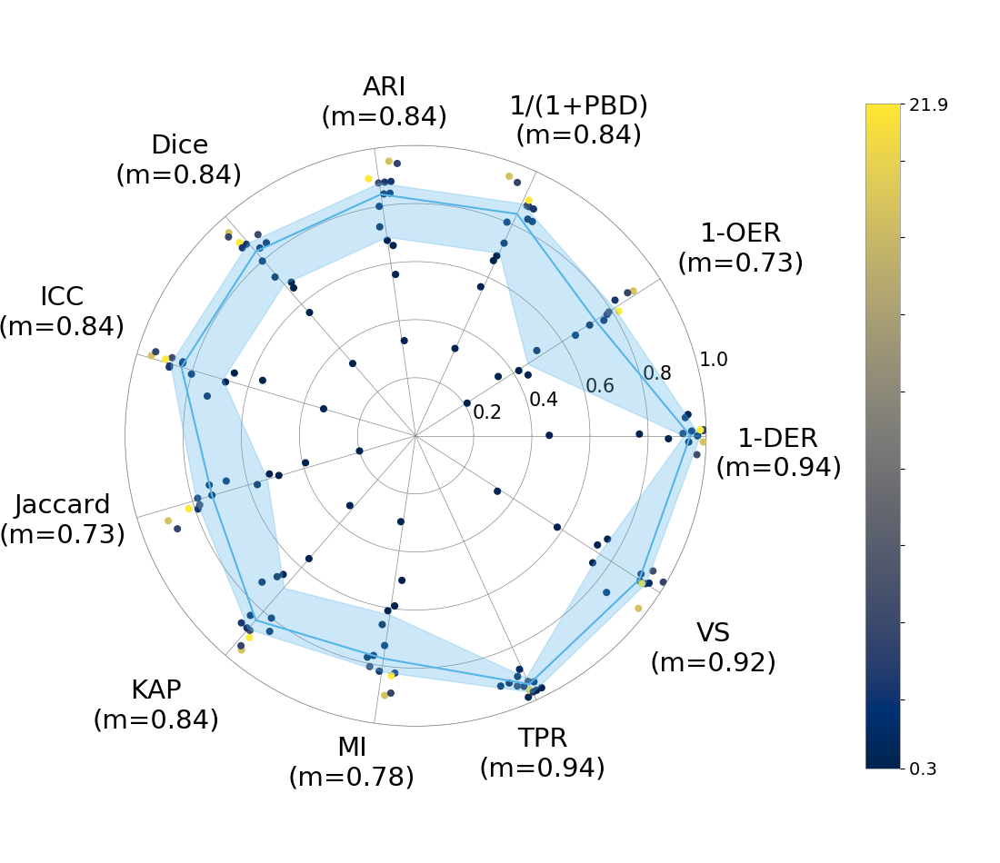

# EISRAD
**EISRAD** (Evaluation of Image Segmentations using RADar plots) is a tool to compare binary segmentations using a suite of similarity and agreement metrics, visualized as radar plots.

_(“Eisrad” is also the German word for "ice circle" – a natural phenomenon appearing on the Vigala River in Estonia)_



---

## 📌 Key Features

- Compares paired segmentations across a broad set of metrics
- Produces clean, interpretable **radar plots** summarizing results
- Exports numerical metrics to CSV
- Supports batch evaluation and cohort-wide summaries
- Binarizes input segmentations if needed
- Fully modular and Python 3 compatible

---

## 📖 Citation

If you use this tool in your research, please cite:

> Dubost, Florian, et al.  
> _Multi-atlas image registration of clinical data with automated quality assessment using ventricle segmentation._  
> Medical Image Analysis (2020): 101698.  
> https://doi.org/10.1016/j.media.2020.101698

---

## 🚀 Quick Start

Run a basic segmentation comparison and generate a radar plot:

```bash
python eisrad.py -f segmentations.csv -o radar.png -r metrics.csv -b
```

---

## 🧠 Input Format

EISRAD expects a CSV file with two columns:

```csv
manual,auto
/path/to/manual_seg.nii.gz,/path/to/auto_seg.nii.gz
```

- Files must be in `.nii` or `.nii.gz` format.
- Segmentations should be aligned in space and shape.
- Use `-b` to binarize all inputs (`> 0` becomes `1`).

---

## 📈 Metrics Included

The following similarity metrics are computed for each segmentation pair:

| Metric | Meaning |
|--------|---------|
| Dice | Overlap between segmentations |
| Jaccard | Intersection over union |
| TPR | True Positive Rate (Sensitivity) |
| VS | Volumetric Similarity |
| MI | Mutual Information |
| ARI | Adjusted Rand Index |
| ICC | Intra-class Correlation |
| PBD | Probabilistic Distance |
| KAP | Cohen's Kappa |
| 1-OER | 1 - Outline Error Rate |
| 1-DER | 1 - Detection Error Rate |

The radar plot shows the **median** value per metric, with an **interquartile ribbon**.

---

## ⚙️ Command-Line Options

Use `--help` for full usage:

```bash
python eisrad.py --help
```

```
Usage: eisrad.py [options]

Options:
  -f FILE, --file=FILE        Input CSV file with 'manual,auto' columns
  -o FILE, --output=FILE      Output radar plot image (.png)
  -r FILE, --results=FILE     Output CSV file with numeric metrics
  -b, --binarize              Binarize input segmentations
  -d, --display               Display plot interactively
  -v, --verbose               Print processing info for each file pair
  -m MIN, --min=MIN           Minimum colorbar value
  -M MAX, --max=MAX           Maximum colorbar value
  -L STRING, --label=STRING   Label for colorbar
  -u STRING, --unit=STRING    Unit for colorbar scale
  -l, --log                   Use log-scaled colorbar
  -h, --help                  Show this help message and exit
```

---

## 📦 Installation

Clone the repo and install dependencies:

```bash
git clone https://github.com/YOURNAME/EISRAD.git
cd EISRAD
pip install -r requirements.txt
```

---

## 📁 Outputs

- **Radar plot** (e.g. `radar.png`) showing metric summary
- **CSV file** (e.g. `metrics.csv`) with per-pair numeric values
- Optionally: colorbar labels scaled to volume or intensity

---

## 🧪 Batch & Cohort Evaluation

EISRAD is modular and designed to support batch processing. You can write a wrapper script to loop through multiple subjects, compare segmentations, and compile cohort-level summaries.

See `scripts/eval_cohort.py` for an example.

---

## 🧊 Credits

Developed by Markus D. Schirmer and collaborators at  
MGH / Harvard Medical School

---

## 📝 License

MIT License
