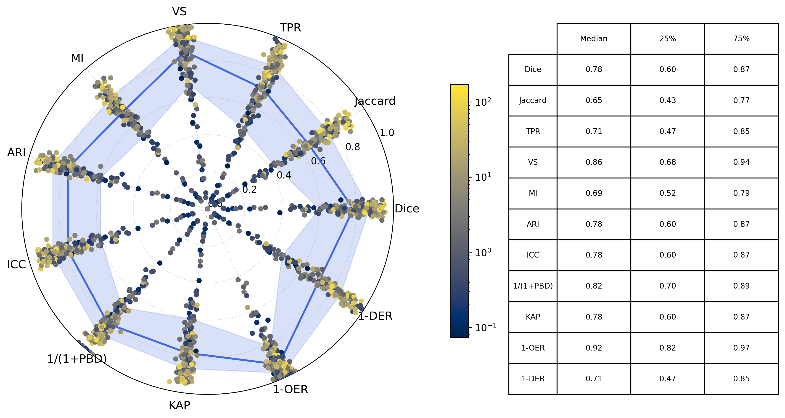
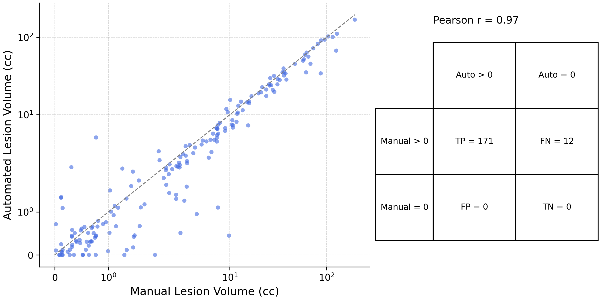
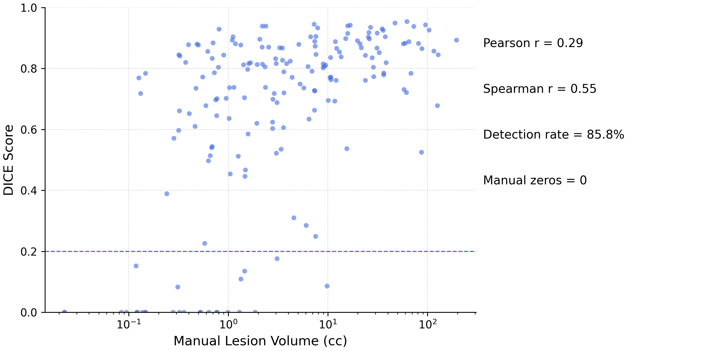

# EISRAD

**EISRAD** (Evaluation of Image Segmentations using RADar plots) is a Python toolkit designed to
quantitatively assess how well automated segmentation algorithms reproduce a manual (reference)
segmentation. It computes a variety of metrics and generates plots to help visualize algorithm
performance across a cohort.

---

## 🔬 Scientific Overview

Below is an example **radar plot** summarizing multiple similarity metrics (e.g., Dice, Jaccard,
true positive rate) for each case in a cohort. Points are colored by the automated segmentation
volume on a logarithmic scale. The solid blue line indicates the median performance across cases,
and the shaded blue band represents the interquartile range (IQR), highlighting variability.



Next, a **volume agreement scatter plot** shows how manual and automated lesion volumes correlate.
Each point represents one case; perfect agreement would lie on the diagonal line. The Pearson
correlation coefficient quantifies overall agreement, while the inset confusion matrix reports the
number of cases where both volumes are zero (no lesion) or nonzero.



Finally, the **DICE vs. lesion volume scatter plot** illustrates how algorithm accuracy (Dice)
depends on lesion size. The red dashed line marks the detection threshold (e.g., Dice = 0.2), and both
Pearson and Spearman correlations are reported.


---

## 🚀 Installation

You can either install EISRAD into your Python environment or run it directly without installation.

### 1. Editable install

```bash
git clone https://github.com/markus-schirmer/eisrad.git
cd eisrad
python3 -m venv venv
source venv/bin/activate
pip install -r requirements.txt
pip install -e . --use-pep517
```

This makes the `eisrad` command available in your shell.

### 2. Run without installing

From the project root (where the `eisrad/` folder lives), you can run:

```bash
# Using module invocation
PYTHONPATH=. python -m eisrad [OPTIONS]

# Or directly with the entrypoint script
python eisrad/__main__.py [OPTIONS]
```

No need for `pip install` if you prefer in-place execution.

---

## 📄 Usage

At minimum, provide an input CSV and output paths:

```bash
eisrad -f pair_list.csv -o radar.png -r metrics.csv
```

- **`-f, --file`**: CSV file with `manual,auto` columns pointing to NIfTI mask paths.  
- **`-o, --output`**: Output radar plot image (default `polar_results.png`).  
- **`-r, --results`**: Output CSV for numeric metrics.

Run `eisrad -h` for the full list of flags.

### Key options

- `-b, --binarize`: Threshold volumes `>0 → 1`.  
- `-l, --log`: Enable log color scale on radar.  
- `--dice-threshold FLOAT`: Low-Dice cutoff (default `0.2`).  
- `--low-dice-csv PATH`: Save cases with Dice < threshold.  
- `--vol-diff-threshold FLOAT`: Relative volume-diff cutoff.  
- `--high-vol-diff-csv PATH`: Save cases exceeding vol-diff.  
- `--scatter-volume PATH`: Save manual vs auto volume scatter.  
- `--scatter-dice PATH`: Save Dice vs volume scatter.

---

## 🔍 Examples

### Basic radar & metrics

```bash
eisrad -f segs.csv -o radar.png -r metrics.csv
```

### Full evaluation with all outputs

```bash
eisrad \
  -f comparison.csv \
  -o comparison/radar.png \
  -r comparison/metrics.csv \
  -l \
  --dice-threshold 0.2 \
  --low-dice-csv comparison/low_dice.csv \
  --vol-diff-threshold 0.5 \
  --high-vol-diff-csv comparison/high_vol_diff.csv \
  --scatter-volume comparison/vol_scatter.png \
  --scatter-dice comparison/dice_scatter.png
```

This generates:

- **Radar plot (log scale)**: `comparison/radar.png`  
- **Metrics CSV**: `comparison/metrics.csv`  
- **Low-Dice cases**: `comparison/low_dice.csv`  
- **High vol-diff cases**: `comparison/high_vol_diff.csv`  
- **Volume scatter**: `comparison/vol_scatter.png`  
- **DICE scatter**: `comparison/dice_scatter.png`  

---

## 📂 Project Structure

```
eisrad/
├─ __main__.py
├─ io.py
├─ metrics.py
├─ reports.py
└─ plots.py
README.md
requirements.txt
setup.py
pyproject.toml
```

---

## 📝 License

Released under the MIT License.
